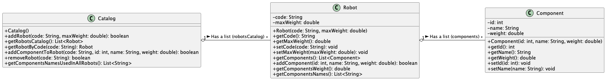

# Taller 7 - Relaciones entre clases y principio de responsabilidad única. 

En este taller se trabajará con relaciones entre clases y el principio de responsabilidad única. Se espera que el estudiante pueda identificar las relaciones entre las clases y cómo estas se comunican entre sí.

## Indice

1. [Preguntas teóricas](#preguntas-teóricas)
2. [Enunciado](#enunciado)
3. [Calificación](#calificación)
4. [¿Qué sigue?](#qué-sigue)
5. [Recursos en línea](#recursos-en-línea)

## Preguntas teóricas

Marque la respuesta correcta a las siguientes preguntas. Estas preguntas no afectan la calificación del taller, pero le ayudarán a reforzar los conceptos vistos en clase.

También, en el repositorio [workshop-9-robots](https://github.com/clase-programacion-avanzada/JAVA-Optional-Workshop-Robots_chain_of_responsibilities) encontrará un ejercicio adicional para reforzar los conceptos vistos en clase.

Para las preguntas 1 a 8, considere el siguiente diagrama de clases:



1. ¿Qué atributos tiene la clase `Component`?
    -  `name`, `id`, `price`
    -  `name`, `id`, `weight`
    -  `name`, `id`, `price`, `weight`, `description`
    -  `name`, `id`, `price`, `weight`, `description`, `type`
2. ¿Cuántos getters y cuántos setters tiene la clase `Component`?
    -  3 getters y 3 setters
    -  3 getters y 2 setters
    -  4 getters y 3 setters
    -  4 getters y 4 setters
3. ¿Qué modificadores de acceso tienen los atributos de la clase `Component`?
    -  Todos los atributos son privados
    -  Todos los atributos son públicos
    -  Todos los atributos son protegidos
    -  Todos los atributos son por defecto
4. ¿Qué tipo de relación existe entre las clases `Component` y `Robot`?
    -  Asociación
    -  Agregación
    -  Composición
    -  Herencia
5. ¿Cuántos atributos tiene la clase `Robot`?
    -  3
    -  2
    -  5
    -  6
6. ¿Cuántos atributos tiene la clase `Catalog`?
    -  1
    -  2
    -  4
    -  3
7. ¿Qué atributos tiene la clase `Catalog`?
    -  `components` (components es una lista de componentes)
    -  `robotsCatalog` (robotsCatalog es una lista de robots)
    -  `components`, `robots` (components y robots son listas de componentes y robots respectivamente)
    -  `components`, `robots`, `name` (components y robots son listas de componentes y robots respectivamente, name es un String)
8. Según el diagrama, qué clase tiene la responsabilidad de crear un nuevo componente (quién puede hacer `new Component(id,name,weight)`).
    -  `Component`
    -  `Robot`
    -  `Catalog`
    -  Ninguna de las anteriores

Las preguntas 9 a 13 toman como referencia el siguiente código, suponga que la clase `Component` ya está implementada:

```java

import Component;

public class Robot {
    private String id;
    private String name;
    private List<Component> components;

    public Robot(String id, String name) {
        this.id = id;
        this.name = name;
        this.components = new ArrayList<>();
    }

    // Getters and Setters

    public void addComponent(int id, String name, double weight) {
        Component component = new Component(id, name, weight);
        // Implementación pregunta 9
    }

    public boolean removeComponent(String id) {
        Component componentToBeRemoved = getComponentById(id);
        if (componentToBeRemoved == null) {
            return false;
        } 
        // Implementación pregunta 10
        
    }

    public Component getComponentById(String id) {
        // Implementación pregunta 11
        
    }

    public String toString() {
        return "Robot{" +
            "id='" + id + '\'' +
            ", name='" + name + '\'' +
            ", components=" + components +
            '}';
    }
}
```
9. ¿Qué instrucción se debe agregar en el método `addComponent` para agregar un componente a la lista de componentes del robot?
    -  `components.add(component)`
    -  `components.add(component.getId(), component)`
    -  `components.add(component.getName(), component)`
    -  `components.add(component.getWeight(), component)`
10. ¿Qué instrucción se debe agregar en el método `removeComponent` para eliminar un componente de la lista de componentes del robot?
    -  `return components.remove(componentToBeRemoved)`
    -  `components.remove(component.getId())`
    -  `return components.remove(components)`
    -  `return components.remove(component.getWeight())`
11. ¿Qué pasos se deben seguir en el método `getComponentById` para obtener un componente de la lista de componentes del robot basado en el id o null si no se encuentra el componente buscado?
    -  Recorrer la lista de componentes y comparar el id de cada componente con el id proporcionado, si se encuentra el componente, devolverlo, de lo contrario devolver null.
    -  Recorrer la lista de componentes y comparar el nombre de cada componente con el nombre proporcionado, si se encuentra el componente, devolverlo, de lo contrario devolver null.
    -  Recorrer la lista de componentes y comparar el peso de cada componente con el peso proporcionado, si se encuentra el componente, devolverlo, de lo contrario devolver null.
    -  Recorrer la lista de componentes y comparar el id de cada componente con el id proporcionado, si se encuentra el componente, devolverlo, de lo contrario devolver null.
12. ¿Cómo es la sintaxis del ciclo for-each (enhanced for loop) para recorrer una lista de componentes en la clase `Robot`?
    -  `for (Component component : components) { }`
    -  `for (Component component in components) { }`
    -  `for (Component component = 0; component < components.size(); component++) { }`
    -  `for (int i = 0; i < components.size(); i++) { }`
13. ¿Cuál es la forma **correcta** de instanciar una lista llamada `robots` que contiene objetos de la clase `Robot`?
    - `List<Robot> robots = new ArrayList<>();`
    - `List<Robot> robots = new List<Robot>();`
    - `List<Robot> robots = new List<>();`
    - `List<Robot> robots;`
14. Cuando se envía un objeto como parámetro a una función, ese objeto se pasa por:
    -  Valor
    -  Referencia
    -  Ninguna de las anteriores
    -  Todas las anteriores
15. ¿Que es un atributo static?
    -  Un atributo que pertenece a la clase y no a las instancias de la clase.
    -  Un atributo que pertenece a las instancias de la clase y no a la clase.
    -  Un atributo que no puede ser modificado.
    -  Un atributo que no puede ser accedido desde otras clases.
16. "Un espacio en la memoria heap donde se almacenan todos los objetos de tipo String que se crean en un programa." ¿A qué se refiere esta definición?
    - A la pila de llamadas.
    - Al Java Virtual Machine.
    - Al Java String Pool.
    - A la memoria RAM.

Si desea practicar más sobre diagramas de clases y relaciones, puede practicar con el taller de [robots](https://github.com/clase-programacion-avanzada/JAVA-Optional-Workshop-Robots_chain_of_responsibilities).

[Volver al índice](#indice)

## Enunciado

A continuación encontrará la petición del cliente para la aplicación de música. Esta aplicación debe permitir al administrador de la aplicación gestionar los artistas, clientes, canciones y listas de reproducción.

Debe conectar las clases que ya tiene implementadas para poder cumplir con los requerimientos del cliente.

### Requerimientos de la aplicación

El cliente desea una aplicación de consola que permita al administrador gestionar los artistas, clientes, canciones y listas de reproducción.


Las reglas del negocio son las siguientes:

- La aplicación debe permitir al administrador crear y eliminar artistas, clientes, canciones y listas de reproducción.
- En el programa, debe haber una lista centralizada donde se almacenen los artistas.
- Al crear un artista, este debe agregarse a la lista centralizada de artistas.
- Al eliminar un artista, se deben eliminar todas las canciones de ese artista y estas deben eliminarse de todas las listas de reproducción en las que existan.
- En el programa, debe haber una lista centralizada donde se almacenen los clientes.
- Al crear un cliente, este debe agregarse a la lista centralizada de clientes. Cada cliente, al crearse, debe tener una lista de artistas seguidos vacía y una lista de listas de reproducción vacía.
- Al eliminar un cliente, no se deben eliminar las listas de reproducción que haya creado.
- En el programa, debe haber una lista centralizada donde se almacenen las canciones.
- Al crear una canción, esta debe agregarse a la lista centralizada de canciones. Cada canción debe tener una lista de artistas que la interpretan, esta lista debe contener al menos un artista.
- Al eliminar una canción, esta debe eliminarse de todas las listas de reproducción en las que exista.
- En el programa, debe haber una lista centralizada donde se almacenen las listas de reproducción. Al momento de crear una lista de reproducción, esta debe crearse con la lista de canciones vacía.
- Al crear una lista de reproducción, esta debe agregarse a la lista centralizada de listas de reproducción.
- Una lista de reproducción no tiene por qué pertenecer a un cliente, es decir, puede existir una lista de reproducción sin que ningún cliente la haya creado.
- Al eliminar una lista de reproducción, esta debe eliminarse de la lista centralizada de listas de reproducción, si algún cliente la tiene en su lista de listas de reproducción, debe eliminarse de allí también.


Al iniciar la aplicación, el programa debe permitir al usuario seleccionar el módulo a utilizar. En este taller, solo se debe implementar el módulo administrador. El menú debe mostrar las siguientes opciones:

```
Seleccione el módulo a utilizar:
1. Módulo administrador

0. Salir
```

Al seleccionar el módulo administrador, el programa debe mostrar las siguientes opciones:

```
    1. Crear artista y agregarlo a la base de datos.
    2. Eliminar artista de la base de datos.
    3. Crear canción y agregarla a la base de datos.
    4. Eliminar canción de la base de datos y las playlists en las que exista.
    5. Crear Cliente y agregarlo a la base de datos.
    6. Eliminar Cliente de la base de datos.
    7. Agregar Playlist a la base de datos.
    8. Eliminar Playlist de la base de datos.
    9. Ver la lista de clientes.
    10. Ver la lista de canciones.
    11. Ver la lista de artistas.
    12. Ver la lista de playlists.
    0. Volver al menú principal.

```

1. Crear un objeto de la clase `Artist` con el nombre que el cliente le indique.
2. Eliminar un objeto de la clase `Artist` con el `id` que el cliente le indique. En este caso, se debe mostrar una lista de todos los artistas que existen en el sistema, de tal forma que el usuario pueda elegir el `id` del artista a eliminar. 
3. Crear un objeto de la clase `Customer` con los datos que el cliente le indique, en este caso la lista de artistas seguidos y las listas de reproducción deben crearse vacías.
4. Eliminar un objeto de la clase `Customer` con el `id` que el cliente le indique. En este caso, se debe mostrar una lista de todos los clientes que existen en el sistema, de tal forma que el usuario pueda elegir el `id` del cliente a eliminar.
5. Crear un objeto de la clase `Playlist` con el nombre que el cliente le indique, la playlist debe crearse con la lista de canciones vacía.
6. Eliminar un objeto de la clase `Playlist` con el `id` que el cliente le indique. En este caso, se debe mostrar una lista de todas las listas de reproducción que existen en el sistema, de tal forma que el usuario pueda elegir el `id` de la lista de reproducción a eliminar.
7. Crear un objeto de la clase `Song` con los datos que el cliente le indique, se deben mostrar en el menú todos los artistas que existen en el sistema, de tal forma que el usuario pueda elegir el id del artista elegido. 
8. Eliminar un objeto de la clase `Song` con el `id` que el cliente le indique. En este caso, se debe mostrar una lista de todas las canciones que existen en el sistema, de tal forma que el usuario pueda elegir el `id` de la canción a eliminar. Debe llamar al método `removeSong` del atributo `adminController` con el `id` proporcionado y cumplir con las restricciones indicadas en la descripción de la clase `AdminController`.
9. Mostrar en pantalla la lista de clientes.
10. Mostrar en pantalla la lista de canciones.
11. Mostrar en pantalla la lista de artistas.
12. Mostrar en pantalla la lista de listas de reproducción.

En todos los casos, los datos que el cliente le indique deben ser ingresados por consola con excepción del `id`, que se generará automáticamente.

[Volver al índice](#indice)

## Calificación

El programa debe compilar y ejecutar sin errores. Se debe cumplir con los siguientes requerimientos:

1. Las clases deben tener correctamente asignadas las responsabilidades.(1.0)
2. La clase `Main` o clases definidas como 'vistas' son las únicas que pueden imprimir en consola y pedir datos.(1.0)
3. El programa debe agregar artistas, clientes, canciones y listas de reproducción a las listas correspondientes.(1.0)
4. El programa debe eliminar artistas, clientes, canciones y listas de reproducción de las listas correspondientes.(1.0)
5. El programa debe mostrar las listas de artistas, clientes, canciones y listas de reproducción en consola.(0.5)
6. Debe crear el diagrama UML de clases completo del proyecto. Puede hacerlo usando [plantuml](https://plantuml.com/class-diagram). (0.5)

Los requerimientos funcionales los validará el cliente (monitor), mientras que el código lo revisará el profesor (puntos 1, 2 y 6).

Aunque los requerimientos se cumplan, el profesor puede indicarle cambios que debe hacer en el código, que serán evaluados en el siguiente taller.

El profesor puede pedirle cambios en el código que no afecten la calificación de este taller, pero que sí afectarán la calificación del siguiente taller.

**Este taller hace parte de su proyecto. Los posteriores talleres no se calificarán hasta que se haya completado este.
Si todo está correcto, sumará 1.0 a su proyecto final. 
Este taller debe ser entregado durante la semana 11**

## ¿Qué sigue?

Como puede darse cuenta, en el proyecto aún no se pueden agregar canciones a las listas de reproducción, ni se pueden seguir artistas. 
Del mismo modo, si algo falla en su programa este terminará abruptamente. En el siguiente taller, se implementarán estas funcionalidades.


## Recursos en línea

- [Class Diagram](https://www.geeksforgeeks.org/unified-modeling-language-uml-class-diagrams/) [Artículo]
- [List Java Examples](https://www.geeksforgeeks.org/list-interface-java-examples/) [Artículo]
- [Java Scanner Class](https://www.geeksforgeeks.org/scanner-class-in-java/) [Artículo]
- [Single Responsibility Principle](https://www.theserverside.com/tip/How-to-apply-the-single-responsibility-principle-in-Java) [Artículo]
- [Java UUID](https://www.geeksforgeeks.org/uuid-class-java/) [Artículo]
- [Final Keyword in Java](https://www.geeksforgeeks.org/final-keyword-java/) [Artículo]