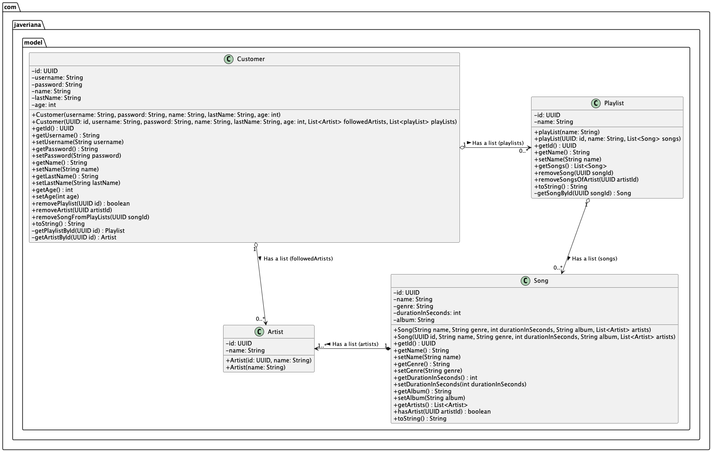
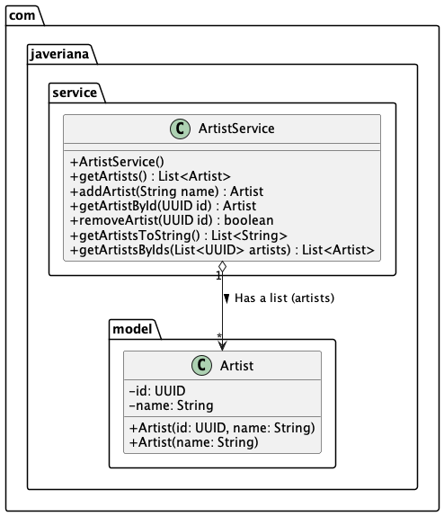
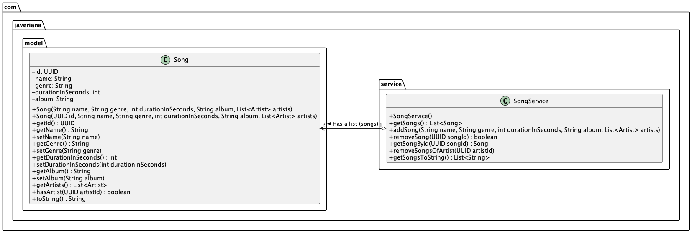

# Taller 7 - Relaciones entre clases y principio de responsabilidad única. 

En este taller se trabajará con relaciones entre clases y el principio de responsabilidad única. Se espera que el estudiante pueda identificar las relaciones entre las clases y cómo estas se comunican entre sí.

## Indice

1. [Preguntas teóricas](#preguntas-teóricas)
2. [Enunciado](#enunciado)
    1. [Paquete model](#paquete-model)
        1. [Clase `Artist`](#clase-artist)
        2. [Clase `Customer`](#clase-customer)
        3. [Clase `Playlist`](#clase-playlist)
        4. [Clase `Song`](#clase-song)
    2. [Paquete service](#paquete-service)
        1. [Clase `ArtistService`](#clase-artistservice)
        2. [Clase `CustomersAdminService`](#clase-customerservice)
        3. [Clase `SongService`](#clase-songservice)
        4. [Clase `PlaylistService`](#clase-playlistservice)
    3. [Paquete controller](#paquete-controller)
       1. [Clase `AdminController`](#clase-admincontroller)
    4. [Paquete view](#paquete-view)
       1. [Clase `AdminView`](#clase-adminview)
    5. [Clases sin paquete](#clases-sin-paquete)
        1. [Clase `Main`](#clase-main)
3. [Calificación](#calificación)
4. [¿Qué sigue?](#qué-sigue)
5. [Recursos en línea](#recursos-en-línea)

## Preguntas teóricas

Marque la respuesta correcta a las siguientes preguntas. Estas preguntas no afectan la calificación del taller, pero le ayudarán a reforzar los conceptos vistos en clase.

También, en el repositorio [workshop-9-robots]() encontrará un ejercicio adicional para reforzar los conceptos vistos en clase.

Para las preguntas 1 a 8, considere el siguiente diagrama de clases:


1. ¿Qué atributos tiene la clase `Component`?
    -  `name`, `id`, `price`
    -  `name`, `id`, `weight`
    -  `name`, `id`, `price`, `weight`, `description`
    -  `name`, `id`, `price`, `weight`, `description`, `type`
2. ¿Cuántos getters y cuántos setters tiene la clase `Component`?
    -  3 getters y 3 setters
    -  3 getters y 2 setters
    -  4 getters y 3 setters
    -  4 getters y 4 setters
3. ¿Qué modificadores de acceso tienen los atributos de la clase `Component`?
    -  Todos los atributos son privados
    -  Todos los atributos son públicos
    -  Todos los atributos son protegidos
    -  Todos los atributos son por defecto
4. ¿Qué tipo de relación existe entre las clases `Component` y `Robot`?
    -  Asociación
    -  Agregación
    -  Composición
    -  Herencia
5. ¿Cuántos atributos tiene la clase `Robot`?
    -  3
    -  2
    -  5
    -  6
6. ¿Cuántos atributos tiene la clase `Catalog`?
    -  1
    -  2
    -  4
    -  3
7. ¿Qué atributos tiene la clase `Catalog`?
    -  `components` (components es una lista de componentes)
    -  `robotsCatalog` (robotsCatalog es una lista de robots)
    -  `components`, `robots` (components y robots son listas de componentes y robots respectivamente)
    -  `components`, `robots`, `name` (components y robots son listas de componentes y robots respectivamente, name es un String)
8. Según el diagrama, qué clase tiene la responsabilidad de crear un nuevo componente (quién puede hacer `new Component(id,name,weight)`).
    -  `Component`
    -  `Robot`
    -  `Catalog`
    -  Ninguna de las anteriores

Las preguntas 9 a 13 toman como referencia el siguiente código, suponga que la clase `Component` ya está implementada:

```java

import Component;

public class Robot {
    private String id;
    private String name;
    private List<Component> components;

    public Robot(String id, String name) {
        this.id = id;
        this.name = name;
        this.components = new ArrayList<>();
    }

    // Getters and Setters

    public void addComponent(int id, String name, double weight) {
        Component component = new Component(id, name, weight);
        // Implementación pregunta 9
    }

    public boolean removeComponent(String id) {
        Component componentToBeRemoved = getComponentById(id);
        if (componentToBeRemoved == null) {
            return false;
        } 
        // Implementación pregunta 10
        
    }

    public Component getComponentById(String id) {
        // Implementación pregunta 11
        
    }

    public String toString() {
        return "Robot{" +
            "id='" + id + '\'' +
            ", name='" + name + '\'' +
            ", components=" + components +
            '}';
    }
}
```
9. ¿Qué instrucción se debe agregar en el método `addComponent` para agregar un componente a la lista de componentes del robot?
    -  `components.add(component)`
    -  `components.add(component.getId(), component)`
    -  `components.add(component.getName(), component)`
    -  `components.add(component.getWeight(), component)`
10. ¿Qué instrucción se debe agregar en el método `removeComponent` para eliminar un componente de la lista de componentes del robot?
    -  `return components.remove(componentToBeRemoved)`
    -  `components.remove(component.getId())`
    -  `return components.remove(components)`
    -  `return components.remove(component.getWeight())`
11. ¿Qué pasos se deben seguir en el método `getComponentById` para obtener un componente de la lista de componentes del robot basado en el id o null si no se encuentra el componente buscado?
    -  Recorrer la lista de componentes y comparar el id de cada componente con el id proporcionado, si se encuentra el componente, devolverlo, de lo contrario devolver null.
    -  Recorrer la lista de componentes y comparar el nombre de cada componente con el nombre proporcionado, si se encuentra el componente, devolverlo, de lo contrario devolver null.
    -  Recorrer la lista de componentes y comparar el peso de cada componente con el peso proporcionado, si se encuentra el componente, devolverlo, de lo contrario devolver null.
    -  Recorrer la lista de componentes y comparar el id de cada componente con el id proporcionado, si se encuentra el componente, devolverlo, de lo contrario devolver null.
12. ¿Cómo es la sintaxis del ciclo for each para recorrer una lista de componentes en la clase `Robot`?
    -  `for (Component component : components) { }`
    -  `for (Component component in components) { }`
    -  `for (Component component = 0; component < components.size(); component++) { }`
    -  `for (int i = 0; i < components.size(); i++) { }`
13. ¿Cuál es la forma **correcta** de instanciar una lista llamada `robots` que contiene objetos de la clase `Robot`?
    - `List<Robot> robots = new ArrayList<>();`
    - `List<Robot> robots = new List<Robot>();`
    - `List<Robot> robots = new List<>();`
    - `List<Robot> robots;`
14. Cuando se envía un objeto como parámetro a una función, ese objeto se pasa por:
    -  Valor
    -  Referencia
    -  Ninguna de las anteriores
    -  Todas las anteriores
15. ¿Que es un atributo static?
    -  Un atributo que pertenece a la clase y no a las instancias de la clase.
    -  Un atributo que pertenece a las instancias de la clase y no a la clase.
    -  Un atributo que no puede ser modificado.
    -  Un atributo que no puede ser accedido desde otras clases.
16. "Un espacio en la memoria heap donde se almacenan todos los objetos de tipo String que se crean en un programa." ¿A qué se refiere esta definición?
    - A la pila de llamadas.
    - Al Java Virtual Machine.
    - Al Java String Pool.
    - A la memoria RAM.

Si desea practicar más sobre diagramas de clases y relaciones, puede practicar con el taller de [robots](https://github.com/clase-programacion-avanzada/JAVA-Optional-Workshop-Robots_chain_of_responsibilities).

[Volver al índice](#indice)

## Enunciado

A continuación se presenta la documentación del proyecto de una aplicación de música. Va a encontrar una explicación detallada de las clases que deben existir en el proyecto.
También, este será el proyecto base para el taller 8.

El primer paso es terminar el taller 6.

Una vez que haya abierto el proyecto, se crearán las clases necesarias para trabajar en el proyecto. Cada una de estas clases deberán estar en el paquete que se le indique.

### Paquetes

#### Paquete model

El paquete `model` contiene las clases que representan las entidades principales de la aplicación de música.
Una entidad, en el contexto de la programación y el desarrollo de software, se refiere a un objeto o concepto que es identificable.
En términos simples, una entidad es una instancia única de un objeto.
En este programa, las entidades son: Artist, Customer, Playlist y Song. A continuación, se describen las clases que deben estar en este paquete. Además, encontrará un diagrama de clases que muestra la relación entre las clases de este paquete.



[Volver al índice](#indice)

##### Clase `Artist`:

La clase `Artist` representa un artista en una aplicación de música. Esta clase no será modificada.

##### Clase `Customer`

La clase `Customer` representa un cliente en una aplicación de música. Esta debe ser modificada para incluir los siguientes atributos:

###### Atributos

En la clase customer, se deben agregar los siguientes atributos:

- `followedArtists`: Este atributo es una lista de la clase `Artist`, que representa los artistas que el cliente sigue.

- `playlists`: Este atributo es una lista de la clase `Playlist`, que representa las listas de reproducción del cliente.
###### Constructores

La clase `Customer` tendrá dos constructores, ya debe estar implementado uno de ellos, se debe implementar el siguiente:

1. `public Customer(UUID id, String username, String password, String name, String lastName, int age, List<Artist> followedArtists, List<Playlist> playlists)`: Este constructor crea un objeto `Customer` con los atributos proporcionados.

###### Métodos

1. `public void removePlayList(UUID id)`: Este método elimina una lista de reproducción de la lista de listas de reproducción del cliente. Debe buscar la lista de reproducción con el `id` proporcionado y eliminarla de la lista de listas de reproducción del cliente si existe.
2. `private Playlist getPlaylistById(UUID id)`: Este método devuelve la lista de reproducción con el `id` proporcionado, si no existe, devuelve `null`.
3. `private Artist getArtistById(UUID id)`: Este método devuelve el artista con el `id` proporcionado, si no existe, devuelve `null`.
4. `public void removeArtist(UUID id)`: Este método elimina un artista de la lista de artistas seguidos del cliente. Debe buscar el artista con el `id` proporcionado y eliminarlo de la lista de artistas seguidos del cliente si existe.

[Volver al índice](#indice)

#### Clase Playlist

La clase `Playlist` representa una lista de reproducción en una aplicación de música.

###### Atributos

En la clase `Playlist` se deben agregar los siguientes atributos:

- `songs`: Este atributo es una lista de la clase `Song`, que representa las canciones de la lista de reproducción.'

###### Constructores

La clase `Playlist` tendrá dos constructores, ya debe estar implementado uno de ellos, se debe implementar el siguiente:

1. `public Playlist(UUID id, String name, List<Song> songs)`: Este constructor crea un objeto `Playlist` con los atributos proporcionados.

###### Métodos

1. `private Song getSongById(UUID id)`: Este método devuelve la canción con el `id` proporcionado, si no existe, devuelve `null`.
2. `public void removeSong(UUID id)`: Este método elimina una canción de la lista de reproducción. Debe buscar la canción con el `id` proporcionado y eliminarla de la lista de canciones de la lista de reproducción si existe.
3. `public void removeSongsFromArtist(UUID id)`: Este método elimina las canciones de un artista de la lista de reproducción. Debe buscar el artista con el `id` proporcionado y eliminar las canciones del artista de la lista de reproducción.

[Volver al índice](#indice)

##### Clase Song

La clase `Song` representa una canción en una aplicación de música.
###### Atributos

En la clase `Song` se deben agregar los siguientes atributos:

- `artists` : Este atributo es una lista de la clase `Artist`, que representa los artistas que interpretan la canción.

###### Constructores

La clase `Song` tendrá dos constructores, ya debe estar implementado uno de ellos, se debe implementar el siguiente:

1. `public Song(UUID id, String name, String genre, int durationInSeconds, String album, List<Artist> artists)`: Este constructor crea un objeto `Song` con los atributos proporcionados.

###### Métodos

1. `public boolean hasArtist(UUID id)`: Este método devuelve `true` si la canción tiene un artista con el `id` proporcionado, de lo contrario, devuelve `false`.

[Volver al índice](#indice)

#### Paquete service

El paquete `service` contiene las clases que representan los servicios que se pueden realizar en la aplicación de música. El motivo de crear estas clases es separar la lógica de negocio de las clases de modelo.

En el futuro, estas clases tendrán en sus métodos, la lógica de negocio de la aplicación, de momento solamente se encargarán de hacer operaciones básicas.

A continuación, se describen las clases que deben estar en este paquete. Además, encontrará un diagrama de clases que muestra la relación entre las clases de este paquete con las clases del paquete `Models`.
##### Clase `ArtistService`




La clase `ArtistService` representa el servicio de artistas en una aplicación de música. Esta clase ya está implementada, tómela como referencia para implementar las demás clases de este paquete.


###### Atributos

1. `artists`: Este atributo es una lista de la clase `Artist`, que representa los artistas de la aplicación.

###### Métodos

1. `public List<Artist> getArtists()` : Este método devuelve una copia de la lista de artistas de la aplicación.
2. `public Artist addArtist(String name)` : Este método agrega un artista a la lista de la aplicación. Debe crear un objeto de la clase `Artist` con el nombre proporcionado y agregarlo a la lista de artistas, además, debe retornar el artista creado.
3. `public boolean removeArtist(UUID id)` : Este método elimina un artista de la lista de la aplicación. Debe buscar el artista con el `id` proporcionado y eliminarlo de la lista de artistas. Si el artista fue eliminado, debe retornar `true`, de lo contrario, debe retornar `false`.
4. `private Artist getArtistById(UUID id)` : Este método devuelve el artista con el `id` proporcionado, si no existe, devuelve `null`.
5. `public List<String> getArtistsToString()` : Este método devuelve una lista de cadenas de caracteres con la información de todos los artistas de la aplicación. Cada cadena de caracteres debe tener el siguiente formato provisto por el método `toString` de la clase `Artist`. Este método se usará para devolver la información de los artistas en la vista, a través del llamado del servicio en el controlador.
6. `public List<Artist> getArtistsByIds(List<UUID> artists)` : Este método devuelve una lista de artistas con los `id` proporcionados. Si no existe un artista con alguno de los `id` proporcionados, no debe ser incluido en la lista.


###### Constructores

La clase `ArtistService` tendrá un constructor que inicializa la lista de artistas vacía.

[Volver al índice](#indice)

##### Clase `CustomersAdminService`


La clase `CustomersAdminService` representa el servicio de clientes en una aplicación de música. Esta clase debe ser implementada siguiendo la misma estructura que la clase `ArtistService`.

###### Atributos

1. `customers`: Este atributo es una lista de la clase `Customer`, que representa los clientes de la aplicación.

###### Métodos

1. `public List<Customer> getCustomers()` : Este método devuelve una copia de la lista de clientes de la aplicación.
2. `public void addCustomer(String username, String password, String name, String lastName, int age)` : Este método agrega un cliente a la lista de la aplicación. Debe crear un objeto de la clase `Customer` con los datos proporcionados y agregarlo a la lista de clientes. Las listas de artistas seguidos y listas de reproducción deben crearse vacías
3. `public boolean removeCustomer(UUID id)` : Este método elimina un cliente de la lista de la aplicación. Debe buscar el cliente con el `id` proporcionado y eliminarlo de la lista de clientes.
4. `public Customer getCustomerById(UUID id)` : Este método devuelve el cliente con el `id` proporcionado, si no existe, devuelve `null`.
5. `public List<String> getCustomersToString()` : Este método devuelve una lista de cadenas de caracteres con la información de todos los clientes de la aplicación. Cada cadena de caracteres debe tener el siguiente formato provisto por el método `toString` de la clase `Customer`. Este método se usará para devolver la información de los clientes en la vista, a través del llamado del servicio en el controlador.
6. `public boolean removePlaylistFromCustomers(UUID playlistId)` : Este método elimina una lista de reproducción de todos los clientes. Debe buscar la lista de reproducción con el `id` proporcionado y eliminarla de las listas de reproducción de los clientes.
7. `public void removeArtistFromCustomers(UUID artistId)` : Este método elimina un artista de las listas de artistas seguidos de los clientes. Debe buscar el artista con el `id` proporcionado y eliminarlo de las listas de artistas seguidos de los clientes.

###### Constructores

La clase `CustomersAdminService` tendrá un constructor que inicializa la lista de clientes vacía.

[Volver al índice](#indice)

##### Clase `SongService`




La clase `SongService` representa el servicio de canciones en una aplicación de música. Esta clase debe ser implementada siguiendo la misma estructura que la clase `ArtistService`.

###### Atributos

1. `songs`: Este atributo es una lista de la clase `Song`, que representa las canciones de la aplicación.

###### Métodos

1. `public List<Song> getSongs()` : Este método devuelve una copia de la lista de canciones de la aplicación.
2. `public void addSong(String name, String genre, int durationInSeconds, String album, List<Artist> artists)` : Este método agrega una canción a la lista de la aplicación. Debe crear un objeto de la clase `Song` con los datos proporcionados y agregarlo a la lista de canciones.
3. `public boolean removeSong(UUID id)` : Este método elimina una canción de la lista de la aplicación. Debe buscar la canción con el `id` proporcionado y eliminarla de la lista de canciones. Debe retornar `true` si la canción fue eliminada, de lo contrario, debe retornar `false`.
4. `public Song getSongById(UUID id)` : Este método devuelve la canción con el `id` proporcionado, si no existe, devuelve `null`.
5. `public List<String> getSongsToString()` : Este método devuelve una lista de cadenas de caracteres con la información de todas las canciones de la aplicación. Cada cadena de caracteres debe tener el siguiente formato provisto por el método `toString` de la clase `Song`. Este método se usará para devolver la información de las canciones en la vista, a través del llamado del servicio en el controlador.
6. `public void removeSongsOfArtist(UUID artistId)` : Este método elimina las canciones de un artista de la lista de canciones. Debe buscar el artista con el `id` proporcionado y eliminar las canciones del artista de la lista de canciones.

###### Constructores

La clase `SongService` tendrá un constructor que inicializa la lista de canciones vacía.

[Volver al índice](#indice)

##### Clase `PlaylistService`


La clase `PlaylistService` representa el servicio de listas de reproducción en una aplicación de música. Esta clase debe ser implementada siguiendo la misma estructura que la clase `ArtistService`.

###### Atributos

1. `playlists`: Este atributo es una lista de la clase `Playlist`, que representa las listas de reproducción de la aplicación.

###### Métodos

1. `public List<Playlist> getPlaylists()` : Este método devuelve una copia de la lista de listas de reproducción de la aplicación.
2. `public Playlist addPlaylist(String name)` : Este método agrega una lista de reproducción a la lista de la aplicación. Debe crear un objeto de la clase `Playlist` con el nombre proporcionado, agregarlo a la lista de listas de reproducción y retornar la playlist creada.
3. `public boolean removePlaylist(UUID id)` : Este método elimina una lista de reproducción de la lista de la aplicación. Debe buscar la lista de reproducción con el `id` proporcionado y eliminarla de la lista de listas de reproducción. Debe retornar `true` si la lista de reproducción fue eliminada, de lo contrario, debe retornar `false`.
4. `public Playlist getPlaylistById(UUID id)` : Este método devuelve la lista de reproducción con el `id` proporcionado, si no existe, devuelve `null`.
5. `public List<String> getPlaylistsToString()` : Este método devuelve una lista de cadenas de caracteres con la información de todas las listas de reproducción de la aplicación. Cada cadena de caracteres debe tener el siguiente formato provisto por el método `toString` de la clase `Playlist`. Este método se usará para devolver la información de las listas de reproducción en la vista, a través del llamado del servicio en el controlador.
6. `public void removeSongsOfArtist(UUID artistId)` : Este método elimina las canciones de un artista de las listas de reproducción. Debe buscar el artista con el `id` proporcionado y eliminar las canciones del artista de las listas de reproducción.
7. `public void removeSongFromPlaylists(UUID uuid)` : Este método elimina una canción de todas las listas de reproducción. Debe buscar la canción con el `id` proporcionado y eliminarla de las listas de reproducción.

###### Constructores

La clase `PlaylistService` tendrá un constructor que inicializa la lista de listas de reproducción vacía.

[Volver al índice](#indice)

### Paquete controller

El paquete `controller` contiene las clases que representan los controladores de la aplicación de música. Estas clases se encargan de recibir las peticiones del cliente y comunicarse con los servicios para realizar las operaciones solicitadas.
Esto implica que estas clases deben validar los datos proporcionados por el cliente antes de enviarlos a los servicios, o transformar los datos para que puedan ser procesados por los servicios (como convertir un `String` a un `UUID`).

A continuación, se describen las clases que deben estar en este paquete. Además, encontrará un diagrama de clases que muestra la relación entre las clases de este paquete con las clases del paquete `service`.

#### Clase `AdminController`


La clase `AdminController` representa el controlador de administrador en una aplicación de música.

###### Atributos

1. `artistService`: Este atributo es un objeto de la clase `ArtistService`, que representa el servicio de artistas de la aplicación.
2. `customersAdminService`: Este atributo es un objeto de la clase `CustomersAdminService`, que representa el servicio de clientes de la aplicación.
3. `songService`: Este atributo es un objeto de la clase `SongService`, que representa el servicio de canciones de la aplicación.
4. `playlistService`: Este atributo es un objeto de la clase `PlaylistService`, que representa el servicio de listas de reproducción de la aplicación.

###### Métodos

1. `public void addArtist(String name)` : Este método agrega un artista a la lista de la aplicación. Debe llamar al método `addArtist` del atributo `artistService` con el nombre proporcionado.
2. `public void removeArtist(String id)` : Este método elimina un artista de la lista de la aplicación. Debe llamar al método `removeArtist` del atributo `artistService` con el `id` proporcionado. Si artista fue eliminado, debe eliminar las canciones del artista, las canciones eliminadas deben ser eliminadas de las listas de reproducción y de las listas de artistas seguidos de los clientes.
3. `public void addCustomer(String username, String password, String name, String lastName, int age)` : Este método agrega un cliente a la lista de la aplicación. Debe llamar al método `addCustomer` del atributo `customersAdminService` con los datos proporcionados.
4. `public void removeCustomer(String id)` : Este método elimina un cliente de la lista de la aplicación. Debe llamar al método `removeCustomer` del atributo `customersAdminService` con el `id` proporcionado.
5. `public void addSong(String name, String genre, int durationInSeconds, String album, List<String> artists)` : Este método agrega una canción a la lista de la aplicación. Debe llamar al método `addSong` del atributo `songService` con los datos proporcionados.
6. `public void removeSong(String id)` : Este método elimina una canción de la lista de la aplicación. Debe llamar al método `removeSong` del atributo `songService` con el `id` proporcionado. Si la canción fue eliminada, debe eliminar la canción de las listas de reproducción.
7. `public void addPlaylist(String name)` : Este método agrega una lista de reproducción a la lista de la aplicación. Debe llamar al método `addPlaylist` del atributo `playlistService` con el nombre proporcionado.
8. `public void removePlaylist(String id)` : Este método elimina una lista de reproducción de la lista de la aplicación. Debe llamar al método `removePlaylist` del atributo `playlistService` con el `id` proporcionado. Si la lista de reproducción fue eliminada, debe eliminar la lista de reproducción de los clientes.
9. `public List<String> getCustomersToString()` : Este método devuelve una lista de cadenas de caracteres con la información de todos los clientes de la aplicación. Debe llamar al método `getCustomersToString` del atributo `customersAdminService`. Cada cadena de caracteres debe tener el siguiente formato provisto por el método `toString` de la clase `Customer`. Este método se usará para devolver la información de los clientes en la vista.
10. `public List<String> getSongsToString()` : Este método devuelve una lista de cadenas de caracteres con la información de todas las canciones de la aplicación. Debe llamar al método `getSongsToString` del atributo `songService`. Cada cadena de caracteres debe tener el siguiente formato provisto por el método `toString` de la clase `Song`. Este método se usará para devolver la información de las canciones en la vista.
11. `public List<String> getArtistsToString()` : Este método devuelve una lista de cadenas de caracteres con la información de todos los artistas de la aplicación. Debe llamar al método `getArtistsToString` del atributo `artistService`. Cada cadena de caracteres debe tener el siguiente formato provisto por el método `toString` de la clase `Artist`. Este método se usará para devolver la información de los artistas en la vista.
12. `public List<String> getPlaylistsToString()` : Este método devuelve una lista de cadenas de caracteres con la información de todas las listas de reproducción de la aplicación. Debe llamar al método `getPlaylistsToString` del atributo `playlistService`. Cada cadena de caracteres debe tener el siguiente formato provisto por el método `toString` de la clase `Playlist`. Este método se usará para devolver la información de las listas de reproducción en la vista.

###### Constructores

La clase `AdminController` tendrá un constructor que inicializa los atributos con los servicios correspondientes.

- `public AdminController(ArtistService artistService, CustomersAdminService customersAdminService, SongService songService, PlaylistService playlistService)`: Este constructor crea un objeto `AdminController` con los servicios proporcionados.

[Volver al índice](#indice)

#### Paquete view

El paquete `view` contiene las clases que representan las vistas de la aplicación de música. Estas clases se encargan de mostrar la información al cliente y de recibir los datos que el cliente proporciona.
Esto quiere decir que estas clases son las únicas que pueden interactuar con el cliente, es decir, leer y escribir en la consola.

A continuación, se describen las clases que deben estar en este paquete. Además, encontrará un diagrama de clases que muestra la relación entre las clases de este paquete con las clases del paquete `controller`.

#### Clase `AdminView`


La clase `AdminView` representa la vista de administrador en una aplicación de música. Esta clase está parcialmente implementada, tómela como referencia.

###### Atributos

1. `adminController`: Este atributo es un objeto de la clase `AdminController`, que representa el controlador de administrador de la aplicación.
2. `scanner`: Este atributo es un objeto de la clase `Scanner`, que se utiliza para leer los datos proporcionados por el cliente.

###### Métodos

1. `public void showMenu()`: Este método muestra un menú con las opciones disponibles para el administrador. Las opciones son:
    ```
    1. Crear artista y agregarlo a la base de datos.
    2. Eliminar artista de la base de datos.
    3. Crear canción y agregarla a la base de datos.
    4. Eliminar canción de la base de datos y las playlists en las que exista.
    5. Crear Cliente y agregarlo a la base de datos.
    6. Eliminar Cliente.
    7. Agregar Playlist.
    8. Eliminar Playlist.
    9. Ver la lista de clientes.
    10. Ver la lista de canciones.
    11. Ver la lista de artistas.
    12. Ver la lista de playlists.
    0. Volver al menú principal.
    ```

2. `public void addArtist()`: Este método solicita al usuario el nombre del artista y llama al método `addArtist` del atributo `adminController` con el nombre proporcionado.
3. `public void removeArtist()`: Este método solicita al usuario el `id` del artista y llama al método `removeArtist` del atributo `adminController` con el `id` proporcionado.
4. `public void addCustomer()`: Este método solicita al usuario los datos del cliente y llama al método `addCustomer` del atributo `adminController` con los datos proporcionados.
5. `public void removeCustomer()`: Este método solicita al usuario el `id` del cliente y llama al método `removeCustomer` del atributo `adminController` con el `id` proporcionado.
6. `public void addSong()`: Este método solicita al usuario los datos de la canción y llama al método `addSong` del atributo `adminController` con los datos proporcionados.
7. `public void removeSong()`: Este método solicita al usuario el `id` de la canción y llama al método `removeSong` del atributo `adminController` con el `id` proporcionado.
8. `public void addPlaylist()`: Este método solicita al usuario el nombre de la lista de reproducción y llama al método `addPlaylist` del atributo `adminController` con el nombre proporcionado.
9. `public void removePlaylist()`: Este método solicita al usuario el `id` de la lista de reproducción y llama al método `removePlaylist` del atributo `adminController` con el `id` proporcionado.
10. `public void showCustomers()`: Este método llama al método `getCustomersToString` del atributo `adminController` y muestra en pantalla la lista de clientes.
11. `public void showSongs()`: Este método llama al método `getSongsToString` del atributo `adminController` y muestra en pantalla la lista de canciones.
12. `public void showArtists()`: Este método llama al método `getArtistsToString` del atributo `adminController` y muestra en pantalla la lista de artistas.
13. `public void showPlaylists()`: Este método llama al método `getPlaylistsToString` del atributo `adminController` y muestra en pantalla la lista de listas de reproducción.

###### Constructores

- `public AdminView(AdminController adminController, Scanner scanner)`: Este constructor crea un objeto `AdminView` con el controlador de administrador proporcionado y el objeto `Scanner` proporcionado.

## Clases sin paquete

### Clase `Main`


La clase `Main` es la clase principal de la aplicación de música. Contiene el método `main` que se ejecuta cuando se inicia la aplicación.
En este repositorio, se encuentra un esqueleto de la clase `Main`. Este será el que se utilizará de ahora en adelante.

El método `main` se debe modificar para que llame a los métodos de la clase `AdminView` y permita al administrador realizar las siguientes acciones:

1. Crear un objeto de la clase `Artist` con el nombre que el cliente le indique.
2. Eliminar un objeto de la clase `Artist` con el `id` que el cliente le indique. En este caso, se debe mostrar una lista de todos los artistas que existen en el sistema, de tal forma que el usuario pueda elegir el `id` del artista a eliminar. Debe llamar al método `removeArtist` del atributo `adminController` con el `id` proporcionado y cumplir con las restricciones indicadas en la descripción de la clase `AdminController`.
3. Crear un objeto de la clase `Customer` con los datos que el cliente le indique, en este caso la lista de artistas seguidos y las listas de reproducción deben crearse vacías. Debe llamar al método `addCustomer` del atributo `adminController` con los datos proporcionados.
4. Eliminar un objeto de la clase `Customer` con el `id` que el cliente le indique. En este caso, se debe mostrar una lista de todos los clientes que existen en el sistema, de tal forma que el usuario pueda elegir el `id` del cliente a eliminar. Debe llamar al método `removeCustomer` del atributo `adminController` con el `id` proporcionado y cumplir con las restricciones indicadas en la descripción de la clase `AdminController`.
5. Crear un objeto de la clase `Playlist` con el nombre que el cliente le indique, la playlist debe crearse con la lista de canciones vacía. Debe llamar al método `addPlaylist` del atributo `adminController` con el nombre proporcionado.
6. Eliminar un objeto de la clase `Playlist` con el `id` que el cliente le indique. En este caso, se debe mostrar una lista de todas las listas de reproducción que existen en el sistema, de tal forma que el usuario pueda elegir el `id` de la lista de reproducción a eliminar. Debe llamar al método `removePlaylist` del atributo `adminController` con el `id` proporcionado y cumplir con las restricciones indicadas en la descripción de la clase `AdminController`.
7. Crear un objeto de la clase `Song` con los datos que el cliente le indique, se deben mostrar en el menú todos los artistas que existen en el sistema, de tal forma que el usuario pueda elegir el id del artista elegido. Debe llamar al método `addSong` del atributo `adminController` con los datos proporcionados.
8. Eliminar un objeto de la clase `Song` con el `id` que el cliente le indique. En este caso, se debe mostrar una lista de todas las canciones que existen en el sistema, de tal forma que el usuario pueda elegir el `id` de la canción a eliminar. Debe llamar al método `removeSong` del atributo `adminController` con el `id` proporcionado y cumplir con las restricciones indicadas en la descripción de la clase `AdminController`.
9. Mostrar en pantalla la lista de clientes. Debe llamar al método `getCustomersToString` del atributo `adminController`.
10. Mostrar en pantalla la lista de canciones. Debe llamar al método `getSongsToString` del atributo `adminController`.
11. Mostrar en pantalla la lista de artistas. Debe llamar al método `getArtistsToString` del atributo `adminController`.
12. Mostrar en pantalla la lista de listas de reproducción. Debe llamar al método `getPlaylistsToString` del atributo `adminController`.

En todos los casos, los datos que el cliente le indique deben ser ingresados por consola con excepción del `id` que se generará automáticamente.

[Volver al índice](#indice)

## Calificación

El programa debe compilar y ejecutar sin errores. Se debe cumplir con los siguientes requerimientos:

1. Las clases deben estar en los paquetes indicados.(0.5)
2. La clase `Main` y las clases del paquete `views` son las únicas que pueden interactuar con el usuario.(0.5)
3. Los controladores deben llamar a los métodos de los servicios correspondientes.(0.5)
4. Los servicios deben llamar a los métodos de las clases del paquete `models` correspondientes.(0.5)
5. El programa debe agregar artistas, clientes, canciones y listas de reproducción a las listas correspondientes.(1.0)
6. El programa debe eliminar artistas, clientes, canciones y listas de reproducción de las listas correspondientes, cumpliendo con las restricciones indicadas en la descripción de la clase `AdminController`.(2.0)

**Este taller hace parte de su proyecto. Los posteriores talleres no se calificarán hasta que se haya completado este.
Si todo está correcto, sumará 1.0 a su proyecto final. 
Este taller debe ser entregado durante la semana 11**

## ¿Qué sigue?

Como puede darse cuenta, en el proyecto aún no se pueden agregar canciones a las listas de reproducción, ni se pueden seguir artistas. 
Del mismo modo, si algo falla en su programa este terminará abruptamente. En el siguiente taller, se implementarán estas funcionalidades.

## Diagrama de clases completo


## Recursos en línea

- [Class Diagram](https://www.geeksforgeeks.org/unified-modeling-language-uml-class-diagrams/) [Artículo]
- [List Java Examples](https://www.geeksforgeeks.org/list-interface-java-examples/) [Artículo]
- [Java Scanner Class](https://www.geeksforgeeks.org/scanner-class-in-java/) [Artículo]
- [Single Responsibility Principle](https://www.theserverside.com/tip/How-to-apply-the-single-responsibility-principle-in-Java) [Artículo]
- [Java UUID](https://www.geeksforgeeks.org/uuid-class-java/) [Artículo]
- [Final Keyword in Java](https://www.geeksforgeeks.org/final-keyword-java/) [Artículo]